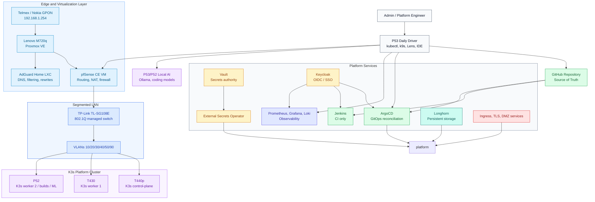
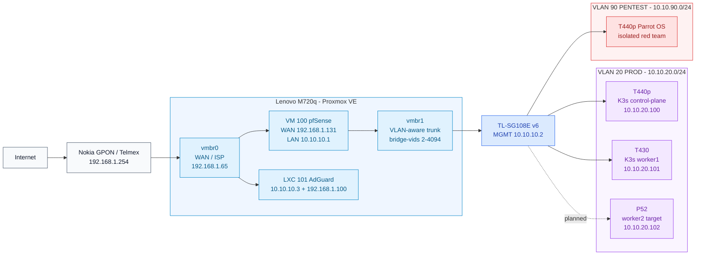
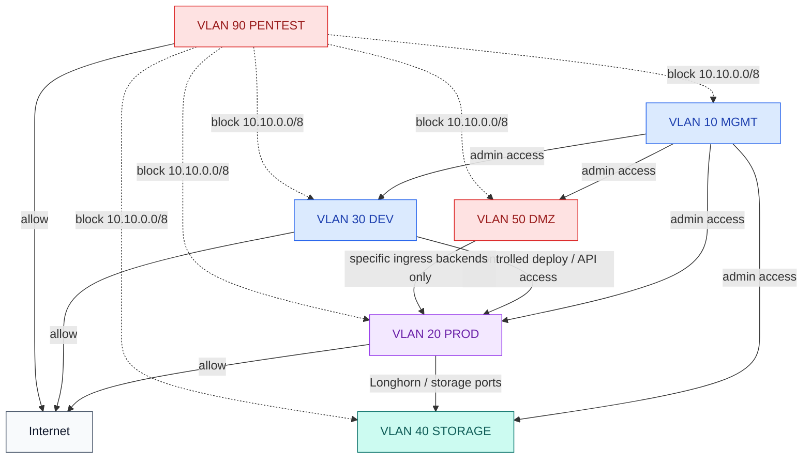
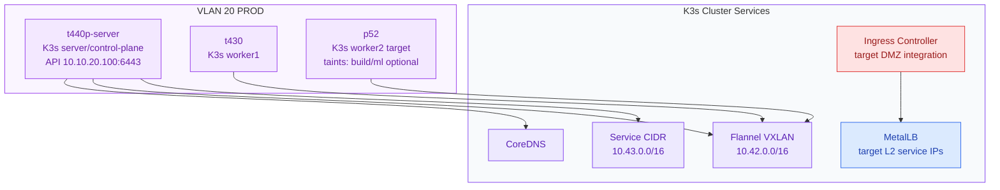
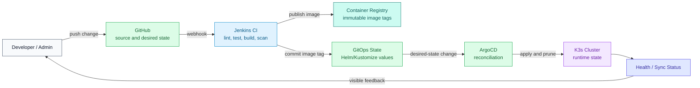
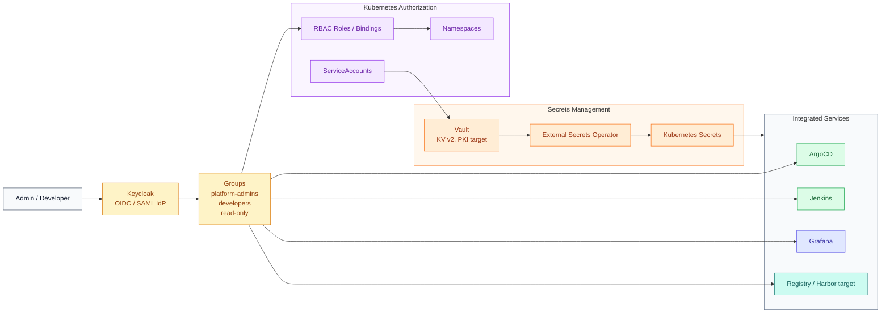
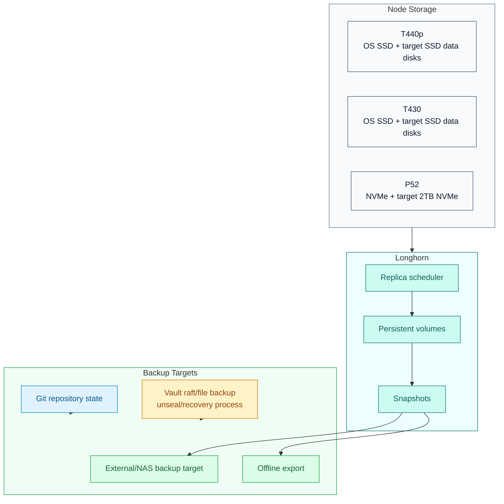

# HomeLab Enterprise Architecture Blueprint

**Version:** 1.0  
**Date:** May 2026  
**Audience:** Technical interviewers, infrastructure architects, platform engineers  
**Scope:** Networking, DevOps, IAM, development, virtualization, Kubernetes, GitOps, security, storage, observability, and disaster recovery

---

## 1. Executive Summary

This HomeLab is designed as an enterprise-style platform engineering environment. Its purpose is not only to run personal services, but to demonstrate production-grade skills across network architecture, Linux operations, virtualization, Kubernetes, GitOps, IAM, secrets management, CI/CD, platform observability, and security segmentation.

The current repository documents a strong foundation: Proxmox VE on a Lenovo M720q, pfSense CE as inter-VLAN router and firewall, AdGuard Home for internal DNS and filtering, a TP-Link TL-SG108E managed switch with 802.1Q VLANs, and Fedora-based K3s nodes prepared for cluster installation. The repository also contains historical GitOps assets under `docs/old` that model Jenkins, Vault, External Secrets Operator, ArgoCD, Helm charts, and workload delivery patterns.

The target architecture is a reproducible GitOps platform where Git is the source of truth, Jenkins performs CI only, ArgoCD owns reconciliation, Vault is the secrets authority, External Secrets Operator synchronizes runtime secrets, Keycloak provides identity federation, pfSense enforces segmentation, and K3s hosts platform and showcase workloads.

This document intentionally separates:

- **Current state:** what is already documented or validated in the repo.
- **Target state:** the enterprise architecture the lab should converge toward.
- **Gaps:** risks, inconsistencies, and missing implementation evidence.
- **Roadmap:** the phased path from the current state to a credible enterprise showcase.

---

## 2. Architecture Principles

| Principle | Design Implication |
|---|---|
| Separation of duties | M720q remains the perimeter and virtualization host. K3s workloads run on dedicated cluster nodes, not on the firewall/gateway host. |
| Git as source of truth | Runtime platform state is declared in Git and reconciled by ArgoCD. Manual changes are treated as temporary break-glass operations. |
| CI and CD separation | Jenkins builds, tests, scans, and publishes artifacts. ArgoCD deploys. Jenkins must not run direct `kubectl apply` or `helm upgrade` in the target model. |
| Least privilege | IAM, Vault policies, Kubernetes RBAC, and VLAN firewall rules restrict access by role, namespace, and network zone. |
| Network segmentation first | Management, production, development, storage, DMZ, and pentesting traffic are separated by VLAN and enforced through pfSense. |
| Reproducibility | Bootstrap, validation, and recovery procedures must be scripted and documented. |
| Observable operations | Metrics, logs, uptime probes, alerts, and dashboards become first-class platform services. |
| Honest portfolio architecture | The design distinguishes proven implementation from planned target-state components. |

---

## 3. Current State Assessment

### 3.1 Implemented or Strongly Documented

| Domain | Current Evidence | Maturity |
|---|---|---|
| Virtualization | Proxmox VE 9.1.1 on Lenovo M720q; vmbr0 for WAN/ISP; vmbr1 VLAN-aware trunk; reserved vmbr2-vmbr4. | Strong foundation |
| Networking | TL-SG108E configured with VLANs 10, 20, 30, 40, 50, 90; port layout documented. | Strong foundation |
| Firewall and routing | pfSense CE 2.7.2 VM with WAN, LAN, VLAN subinterfaces, DHCP, and firewall policy documentation. | Strong foundation |
| DNS | AdGuard Home LXC dual-homed on VLAN 10 and Telmex LAN; DNS rewrites and upstream DoH documented. | Strong foundation |
| K3s readiness | T440p and T430 Fedora nodes passed pre-install checks; scripts exist for audit and remediation. | Prepared |
| Hardware planning | `homelab_design.jsx` models machines, roles, upgrades, VLANs, K3s, GitOps, IAM, and storage. | Strong design asset |
| Local AI workstation | P53 local AI environment documented with Ollama, GPU offload, model storage, and IDE integration. | Specialized workload |

### 3.2 Designed or Historical

| Domain | Current Evidence | Status |
|---|---|---|
| GitOps | `docs/old/clusters/homelab` contains ArgoCD root app and app-of-apps patterns. | Historical/reference |
| Jenkins | Manual and old platform manifests show Helm/JCasC/Vault integration patterns. | Historical/reference |
| Vault | Old setup manual and bootstrap script document KV, Kubernetes auth, and Jenkins integration. | Historical/reference |
| External Secrets Operator | Old manifests include ESO Helm app and Vault `ClusterSecretStore`. | Historical/reference |
| Longhorn | Old manual documents storage design, prerequisites, disk layout, and backup concepts. | Historical/reference |
| Workloads | Homepage, CalibreWeb, and registry manifests exist under `docs/old`. | Historical/reference |

### 3.3 Key Gaps and Risks

| Risk | Impact | Recommended Fix |
|---|---|---|
| `docs/architecture.md` is empty | The repository lacks a canonical architecture reference. | Use this document as the canonical blueprint or link it from `README.md`. |
| GitOps assets are under `docs/old` | The active repo does not currently expose a clean GitOps source-of-truth tree at root. | Promote validated assets into `clusters/`, `platform/`, `helm/`, and `workloads/` when implementation begins. |
| Sensitive-looking Vault artifacts exist under `docs/old/.vault-*` | Even if obsolete, this weakens security posture in a public or portfolio repo. | Remove from Git history if real; rotate affected secrets; keep only sanitized examples. |
| Legacy scripts model direct deploys | Direct `helm upgrade`/`kubectl` deployment conflicts with target GitOps architecture. | Refactor CI to publish artifacts and commit declarative state only. |
| K3s is documented as ready, not fully reconciled | Architects will ask what is running versus planned. | Add installation evidence, node joins, kubeconfig handling, and post-install validation. |
| IAM target lacks active implementation evidence | Keycloak/OIDC and RBAC are architectural goals but not yet implemented. | Add Keycloak phase with OIDC integrations and RBAC maps. |
| Storage HA needs a third worker | Longhorn with two nodes has limited failure tolerance. | Add P52 as worker2 and dedicate SSD/NVMe-backed Longhorn paths. |

---

## 4. Target Architecture Overview



### Architectural Intent

The M720q hosts the enterprise edge: Proxmox, pfSense, and AdGuard. K3s nodes are separated on VLAN 20 and receive traffic through pfSense-controlled routing. GitHub becomes the declarative control plane. Jenkins validates and produces artifacts, while ArgoCD reconciles the cluster from Git. Vault and ESO eliminate static application secrets. Keycloak provides human identity and SSO. Observability, storage, and backup services make the platform operable rather than merely deployable.

---

## 5. Physical and Network Topology



### VLAN Plan

| VLAN | Name | Subnet | Gateway | Purpose | DHCP |
|---:|---|---|---|---|---|
| 10 | MGMT | 10.10.10.0/24 | 10.10.10.1 | Management plane: pfSense, switch, AdGuard, admin access | Static |
| 20 | PROD | 10.10.20.0/24 | 10.10.20.1 | K3s production cluster nodes | Yes |
| 30 | DEV | 10.10.30.0/24 | 10.10.30.1 | Development, builds, staging | Yes |
| 40 | STORAGE | 10.10.40.0/24 | 10.10.40.1 | Longhorn replication and storage traffic | Static |
| 50 | DMZ | 10.10.50.0/24 | 10.10.50.1 | Ingress and exposed services | Static |
| 90 | PENTEST | 10.10.90.0/24 | 10.10.90.1 | Red-team / pentesting, isolated | Yes |

### Firewall Policy



Key policy decision: the pentesting machine is physically and logically isolated. It may reach the internet, but must not reach internal lab networks.

---

## 6. Kubernetes and Platform Layer

### 6.1 K3s Target Topology



Current K3s evidence shows node readiness, not full cluster reconciliation. The next architecture milestone should document:

- K3s server installation on `t440p-server`.
- Worker join for `t430`.
- P52 join as worker2.
- `kubectl get nodes -o wide` evidence.
- Firewall trusted sources for pod/service CIDRs.
- DNS rewrite such as `k3s.mgmt -> 10.10.20.100`.

### 6.2 Workload Placement

| Node | Target Role | Workload Policy |
|---|---|---|
| T440p | Control-plane | Keep lightweight; avoid heavy CI/build/ML workloads. |
| T430 | Worker 1 / storage | General workloads and Longhorn replica after SSD upgrade. |
| P52 | Worker 2 / build / ML | Build workloads, local inference, heavier apps; use taints/tolerations to protect platform workloads. |
| M720q | Edge/virtualization | Do not schedule K3s workloads; keep firewall, DNS, and Proxmox responsibilities isolated. |

---

## 7. GitOps and CI/CD Target Architecture



### CI/CD Contract

| Component | Responsibility | Anti-Pattern to Avoid |
|---|---|---|
| GitHub | Source code and declarative platform state | Manual cluster state outside Git |
| Jenkins | Build, test, scan, publish, commit image tags | Direct `kubectl apply` or `helm upgrade` |
| Registry | Store immutable artifacts | Relying on `latest` for promotion |
| ArgoCD | Reconcile desired state into K3s | Treating ArgoCD as optional dashboard only |
| Helm/Kustomize | Render environment-specific manifests | Unversioned manual configuration |

### Target Repository Layout

```text
HomeLab/
├── clusters/
│   └── homelab/
│       ├── argocd/
│       ├── platform/
│       └── workloads/
├── platform/
│   ├── argocd/
│   ├── cert-manager/
│   ├── eso/
│   ├── ingress/
│   ├── jenkins/
│   ├── keycloak/
│   ├── longhorn/
│   ├── monitoring/
│   ├── policy/
│   └── vault/
├── helm/
│   └── custom/
├── workloads/
│   ├── homepage/
│   ├── calibreweb/
│   ├── registry/
│   └── showcase-apps/
├── scripts/
└── docs/
```

The current repo stores most GitOps examples under `docs/old`; promoting them to this structure should be a deliberate implementation phase with validation and secret hygiene.

---

## 8. IAM and Secrets Architecture



### IAM Target Controls

| Control | Target Implementation |
|---|---|
| Human identity | Keycloak realm for lab users and admin personas. |
| SSO | OIDC integration for ArgoCD, Jenkins, Grafana, and registry UI. |
| Kubernetes authorization | Group-to-role mappings and namespace-scoped RBAC. |
| Secret authority | Vault KV v2 for application and platform secrets. |
| Runtime secret sync | External Secrets Operator pulls from Vault into Kubernetes Secrets. |
| Token lifetime | Short-lived Vault tokens through Kubernetes auth. |
| Admin recovery | Break-glass local admin accounts documented and protected. |

---

## 9. Storage, Backup, and Disaster Recovery



### Storage Strategy

| Layer | Target |
|---|---|
| OS disks | Keep OS and Kubernetes runtime separate from persistent application data. |
| Longhorn data path | Dedicated SSD/NVMe path per node, not root filesystem. |
| Replica count | Use replica count 2 or 3 after P52 joins and SSD upgrades complete. |
| Backup target | External target for Longhorn snapshots and critical PVC backups. |
| Registry data | Prefer Longhorn-backed PVC or dedicated storage class with backup policy. |
| Vault data | Backup and recovery tested separately from app PVC backups. |

### Recovery Scenarios

| Scenario | Expected Recovery Path |
|---|---|
| Single worker loss | Longhorn replicas remain healthy; workloads reschedule. |
| Control-plane loss | Rebuild K3s server from documented bootstrap; restore cluster state from GitOps and backups. |
| Vault sealed/unavailable | Use documented unseal or recovery procedure; ESO reconciles after Vault availability returns. |
| GitOps drift | ArgoCD detects drift and self-heals, or reports manual divergence. |
| DNS failure | AdGuard dual-homed design preserves fallback for Telmex LAN and VLAN clients. |

---

## 10. Observability and Security Operations

### Observability Stack

| Capability | Target Tooling |
|---|---|
| Metrics | Prometheus / kube-prometheus-stack |
| Dashboards | Grafana |
| Logs | Loki + Promtail or Grafana Alloy |
| Uptime | Uptime Kuma for external and internal service checks |
| Network visibility | pfSense dashboards, firewall logs, DNS query logs |
| Storage health | Longhorn metrics and alerts |
| GitOps state | ArgoCD sync/health dashboards |

### Security Operations

| Capability | Target Tooling or Practice |
|---|---|
| Network isolation | pfSense firewall rules and VLAN segmentation |
| DNS filtering | AdGuard blocklists, rewrites, and query logging |
| Image scanning | Trivy or Jenkins pipeline scans |
| Policy enforcement | Kyverno or Gatekeeper |
| Runtime posture | Kubernetes security contexts, Pod Security Admission, least privilege service accounts |
| Secrets hygiene | Vault, ESO, secret scanning, no committed tokens |
| Red team isolation | Dedicated VLAN 90 with no internal access |

---

## 11. Roadmap

### Phase 0: Repository and Documentation Hygiene

**Goal:** Make the repository credible before expanding implementation.

Deliverables:

- Link this blueprint from `README.md`.
- Decide whether `docs/HomeLab-Enterprise-Architecture.md` replaces or complements `docs/architecture.md`.
- Remove or sanitize sensitive-looking `docs/old/.vault-*` artifacts.
- Add a clear note that `docs/old` is historical/reference material.
- Add secret scanning and validation scripts.

Success criteria:

```bash
git status --short
git ls-files | rg '(^|/)(\.vault|.*token.*|.*\.key$|secret.*\.ya?ml$)'
```

The second command should return no real secrets.

### Phase 1: K3s Cluster Installation

**Goal:** Move from pre-install readiness to a running cluster.

Deliverables:

- Install K3s server on `t440p-server`.
- Join `t430` as worker1.
- Join P52 as worker2.
- Configure firewalld trusted pod and service CIDRs.
- Add DNS rewrites for cluster entrypoints.

Success criteria:

```bash
kubectl get nodes -o wide
kubectl get pods -A
kubectl cluster-info
```

### Phase 2: GitOps Foundation

**Goal:** Establish ArgoCD as the deployment authority.

Deliverables:

- Promote `docs/old/clusters/homelab` into active `clusters/homelab`.
- Add ArgoCD root app and app-of-apps.
- Add AppProjects for platform and workloads.
- Add sync waves and validation.

Success criteria:

```bash
kubectl get applications -n argocd
kubectl get appprojects -n argocd
```

ArgoCD apps should be `Synced` and `Healthy`.

### Phase 3: Secrets and IAM

**Goal:** Replace static credentials with identity-aware secret delivery.

Deliverables:

- Deploy Vault through GitOps or controlled bootstrap.
- Configure Vault Kubernetes auth.
- Deploy External Secrets Operator.
- Configure `ClusterSecretStore`.
- Deploy Keycloak and integrate ArgoCD/Grafana/Jenkins through OIDC.

Success criteria:

```bash
kubectl get clustersecretstore
kubectl get externalsecrets -A
kubectl auth can-i --list --as system:serviceaccount:external-secrets:external-secrets
```

### Phase 4: CI/CD Modernization

**Goal:** Make Jenkins CI-only and GitOps-compatible.

Deliverables:

- Build immutable image tags.
- Push to registry.
- Commit image tag changes to GitOps values.
- Remove direct `kubectl` and `helm upgrade` from active pipelines.

Success criteria:

- Jenkins pipeline produces an immutable artifact.
- ArgoCD, not Jenkins, changes cluster workload state.
- Rollback is possible by reverting Git state.

### Phase 5: Storage and Backup

**Goal:** Make persistent workloads recoverable.

Deliverables:

- Upgrade HDD-backed K3s storage to SSD.
- Add P52 NVMe storage.
- Deploy Longhorn with dedicated data paths.
- Configure recurring backups and test restore.

Success criteria:

```bash
kubectl get storageclass
kubectl get pods -n longhorn-system
kubectl get pvc -A
```

### Phase 6: Observability and Security

**Goal:** Operate the platform like a production environment.

Deliverables:

- Deploy Prometheus, Grafana, Loki, and Uptime Kuma.
- Add alerts for node, storage, DNS, certificate, and GitOps failures.
- Add image scanning and policy enforcement.
- Document incident and recovery runbooks.

Success criteria:

- Dashboards show node, pod, storage, ingress, DNS, and GitOps health.
- At least one alert path is tested.
- Security policies block known-bad workload configurations.

### Phase 7: Showcase Workloads

**Goal:** Demonstrate end-to-end platform capability.

Candidate workloads:

- Homepage dashboard with GitOps delivery.
- Private registry or Harbor.
- CalibreWeb or media app with persistent storage.
- Local AI service exposed internally.
- Dev/staging sample app with CI, scanning, GitOps deployment, Vault secret, and observability dashboard.

Success criteria:

- Each workload has source, CI, artifact, GitOps state, secret model, ingress/DNS, monitoring, and backup policy.

---

## 12. Skills Demonstrated

| Skill Area | Evidence in Architecture |
|---|---|
| Networking | VLAN design, trunking, pfSense routing, firewall policy, DNS architecture. |
| Virtualization | Proxmox bridge design, VM/LXC separation, NIC mapping, persistent VLAN config. |
| Linux administration | Fedora node preparation, SELinux, firewalld, systemd, storage layout. |
| Kubernetes | K3s node prep, CNI planning, service/pod CIDRs, cluster operations. |
| Platform engineering | GitOps, ArgoCD app-of-apps, environment promotion, validation gates. |
| DevOps | Jenkins CI, immutable artifacts, registry, pipeline modernization. |
| IAM | Keycloak target, OIDC integrations, RBAC, namespace access model. |
| Secrets management | Vault, Kubernetes auth, ESO, short-lived credentials. |
| Security | Segmentation, red-team isolation, policy enforcement, secret hygiene, image scanning. |
| Observability | Prometheus, Grafana, Loki, Uptime Kuma, platform health signals. |
| Disaster recovery | GitOps rebuild, Longhorn backups, Vault recovery, documented restore paths. |
| Technical communication | Manuals, diagrams, runbooks, architecture decision rationale. |

---

## 13. Source Documents Reviewed

This blueprint was derived from the repository's current documents and historical references:

| Source | Contribution |
|---|---|
| `README.md` | Initial repo purpose and high-level apps/infrastructure roadmap. |
| `docs/HomeLab-AdGuard-Manual.md` | DNS architecture, AdGuard LXC, dual-homed design, DHCP DNS distribution. |
| `docs/HomeLab-pfSense-config.md` | pfSense VM, VLAN interfaces, DHCP, firewall policy, routing model. |
| `docs/HomeLab-Switch-VLAN.md` | TL-SG108E port layout, VLAN plan, PVIDs, switch management. |
| `docs/HomeLab-Proxmox-VLAN-Persistence.md` | Proxmox bridge design, vmbr mapping, VLAN persistence. |
| `docs/HomeLab-K3s-PreInstall-Manual.md` | K3s node inventory, readiness scripts, prerequisites, install roadmap. |
| `docs/HomeLab-Jenkins-Setup-Manual.md` | Jenkins target model, Helm/JCasC, Vault integration concepts. |
| `docs/P53-i7-LocalIA-Config.md` | Local AI workstation and GPU-backed development workload. |
| `docs/homelab_design.jsx` | Rich interactive model for hardware, network, GitOps, IAM, and storage decisions. |
| `docs/old/GitOps-Platform-Plan.md` | Historical GitOps platform plan, repository layout, CI/CD refactor, security roadmap. |
| `docs/old/clusters/homelab/*` | ArgoCD app-of-apps, ESO, Jenkins, workloads reference manifests. |
| `docs/old/HomeLab-Vault-Setup-Manual.md` | Vault bootstrap, Kubernetes auth, Jenkins integration reference. |
| `docs/old/Longhorn-Configuration-Manual.md` | Longhorn storage, backups, and operational recommendations. |
| `scripts/homelab-k3s-precheck.sh` | Read-only node readiness audit. |
| `scripts/homelab-k3s-prefix.sh` | Idempotent K3s node remediation script. |

---

## 14. Architecture Decision Record Summary

| Decision | Rationale |
|---|---|
| Use pfSense as inter-VLAN firewall | Centralizes routing, NAT, DHCP, and security policy in a familiar enterprise firewall model. |
| Keep AdGuard as direct DNS target | Clients query AdGuard directly; pfSense distributes DNS without becoming the DNS intermediary. |
| Use K3s instead of heavier Kubernetes | K3s fits constrained lab hardware while preserving Kubernetes operational patterns. |
| Add P52 as worker2 | Enables better scheduling capacity, Longhorn replication, build workloads, and local AI integration. |
| Use ArgoCD for deployment authority | Creates auditable, reversible, declarative platform state. |
| Keep Jenkins CI-only | Preserves CI/CD separation and prevents imperative deploy drift. |
| Use Vault plus ESO | Avoids static Kubernetes secrets and demonstrates enterprise secret delivery. |
| Use Keycloak for IAM target | Shows identity federation, OIDC/SAML, and SSO integration skills. |
| Keep pentesting isolated | Demonstrates secure red-team lab design without risking internal platform compromise. |

---

## 15. Final Target State

The desired end state is a fully documented, reproducible enterprise HomeLab where:

- The network is segmented and enforced by pfSense.
- Proxmox hosts only edge and virtualization responsibilities.
- K3s runs platform and workload services on dedicated nodes.
- GitHub is the source of truth for platform and application state.
- Jenkins validates and publishes artifacts without deploying directly.
- ArgoCD continuously reconciles the cluster.
- Vault and ESO provide runtime secrets without committed credentials.
- Keycloak provides SSO and role-based human access.
- Longhorn provides resilient persistent storage with tested backups.
- Observability and security tooling make the platform operable.
- Showcase workloads prove the end-to-end path from code to secure, monitored runtime.

This makes the lab defensible in an architecture interview: it shows not just tools, but boundaries, trade-offs, failure domains, security controls, recovery paths, and an implementation roadmap.
